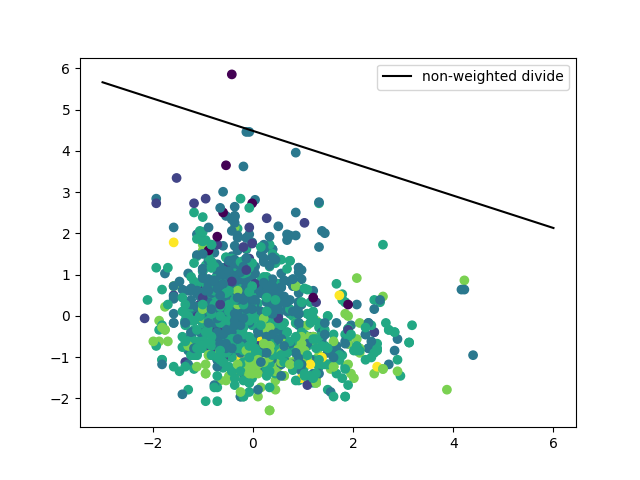
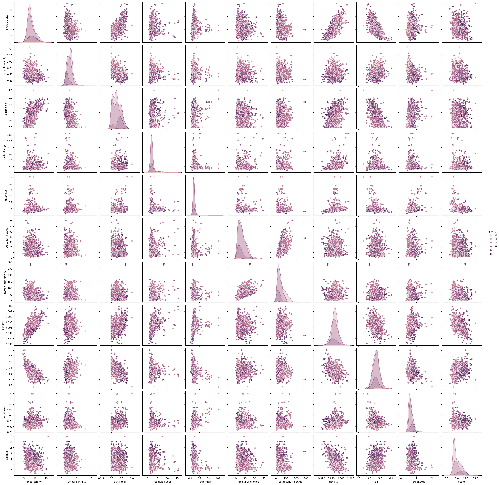

# Wine Quality Prediction with SVM 🍷

---

## Description

This project predicts **wine quality** using the **Linear Support Vector Machine (SVM)** algorithm and recommends wines based on user inputs.
It uses the **Red Wine Quality dataset** from Kaggle and includes visualizations for data analysis and model performance.

* Dataset: [Red Wine Quality (Kaggle)](https://www.kaggle.com/datasets/uciml/red-wine-quality-cortez-et-al-2009?resource=download)
* Author: **Begüm Şara Ünal**

---

## Features

* Explore the dataset with **pandas**
* Visualize distributions and relationships with **Seaborn** and **Matplotlib**
* Preprocess data with **StandardScaler**
* Train a **Linear SVM classifier** and evaluate accuracy
* Visualize decision boundary and coefficients
* Recommend the closest wine to user input

---

## Installation

1. Clone the repository:

```bash
git clone https://github.com/your-username/wine-quality-svm.git
cd wine-quality-svm
```

2. Install required packages:

```bash
pip install pandas numpy seaborn matplotlib scikit-learn
```

3. Download the dataset from [Kaggle](https://www.kaggle.com/datasets/uciml/red-wine-quality-cortez-et-al-2009?resource=download) and place `winequality-red.csv` in the project folder.

---

## Usage

1. Run the script:

```bash
python wineQualityWithSVM.py
```

2. The script will:

   * Display dataset info
   * Train SVM model and print accuracy
   * Plot decision boundary
   * Accept user input to recommend a wine

3. Example input:

```
Fixed Acidity: 7.4
Volatile Acidity: 0.7
Citric Acid: 0.0
Residual Sugar: 1.9
Chlorides: 0.076
Free Sulfur Dioxide: 11.0
Total Sulfur Dioxide: 34.0
Density: 0.9978
PH Value: 3.51
Sulphates: 0.56
Alcohol: 9.4
```

---

## Visualizations 📊

### Plot of Variables




### Plot of All Values




> 💡 Tip: Save your plots as PNGs in `images/` folder using `plt.savefig("images/plot_name.png")`.

---

## License

This project is licensed under the **MIT License**. See [LICENSE](LICENSE) for details.

---

## Contact

* Author: **Begüm Şara Ünal**
* Email: *\[begumsaraunal@gmail.com](mailto:begumsaraunal@gmail.com)]*
